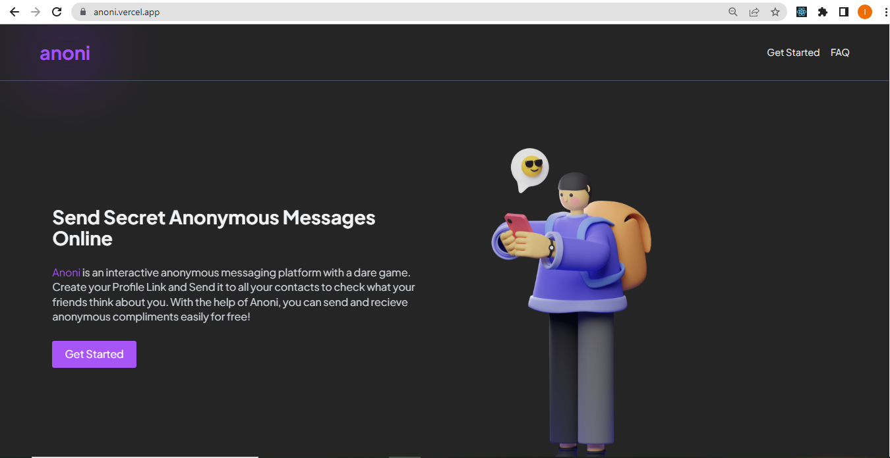

# Anoni

Anoni is an anonymous messaging web application. It allows users to receive anonymous messages and compliments from peers and anyone who has their profile link.

## How To Use

To use Anoni, first sign in with your google account. Then, copy your profile link from your dashboard and share to your friends who can in turn use the link to send you anonymous messages.

You can visit Anoni live [here](https:/anoni.vercel.app)
